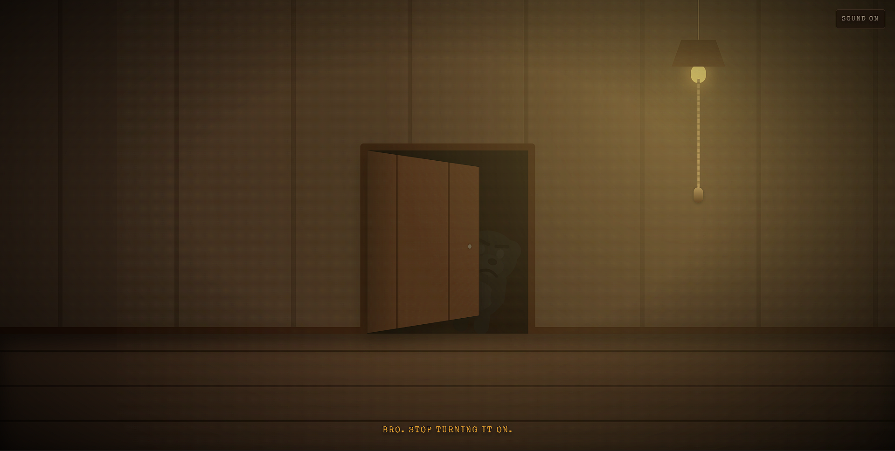

# Useless Project 3.0 🐻💡


## Basic Details
### Team Name: TECHNO


### Team Members
- Member 1: Sarang K - ICCS College of Engineering and Management
- Member 2: Rishith Chandran - ICCS College of Engineering and Management

### Project Description
**Useless Project 3.0** is a deliberately pointless interactive web experience created for a hackathon.
The user enters a dark room, pulls a hanging rope to turn on the light, and then an annoyed bear appears and turns the light back off.

### The Problem (that doesn't exist)
The world has a serious problem: sometimes people turn on lights without considering that a bear might strongly disagree with their decision.

### The Solution (that nobody asked for)
We built an interactive room where turning on a light summons a bear whose only mission is to turn it back off.
The bear enters through an animated door, reacts in different ways, switches the light off, slams the door, and leaves the room ready for the user to repeat the entire pointless process.

## Technical Details
### Technologies/Components Used
For Software:
- TypeScript
- React
- Vite
- CSS
- Browser/Web Audio APIs
- VS Code
- Git & GitHub
- Vercel

For Hardware:
- No hardware required
- Runs completely in a web browser

### Implementation
For Software:
# Installation
```bash
npm install
```

# Run
```bash
npm run dev
```

### Project Documentation
For Software:

# Screenshots



### Project Demo
# Video
[](assets/video.mp4)
*The demo shows the complete interaction from pulling the rope to the bear turning the light off and the room resetting.*

## Team Contributions
- Sarang K: Project development, core interaction logic, bear behavior/animation implementation, and project integration.
- Rishith Chandran: Frontend development, interaction design, testing, deployment, and project documentation.

---
Made with ❤️ at TinkerHub Useless Projects 


